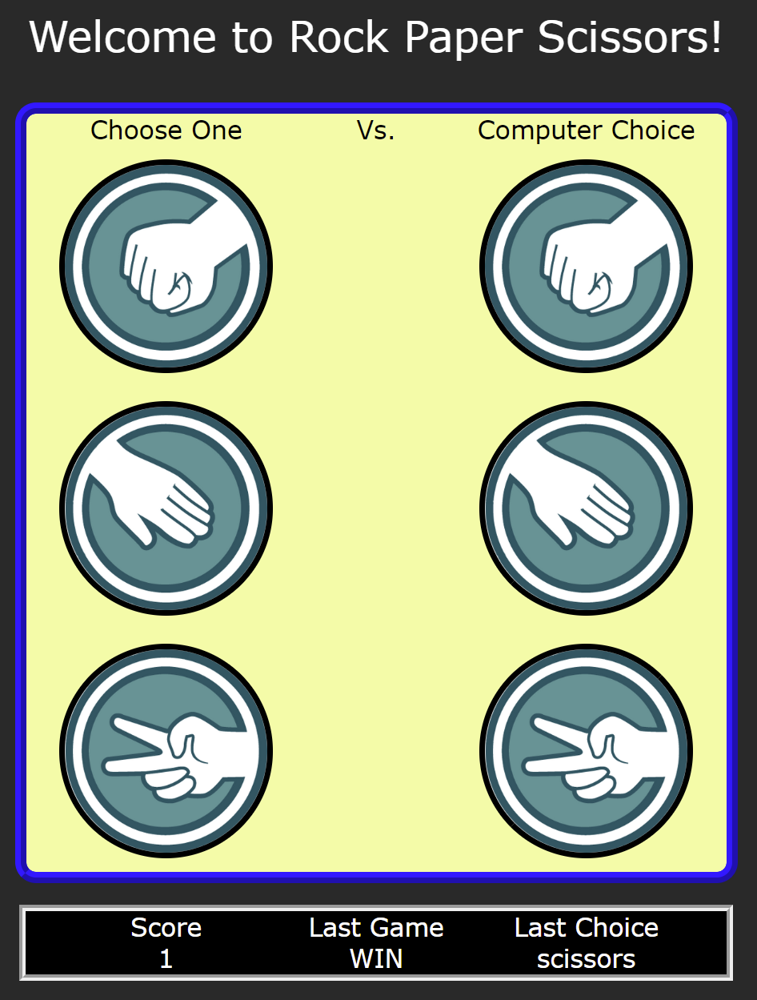

# Rock Paper Scissors Game!

  ### Rock Paper Scissors developed with HTML/CSS/JavaScript
  
 

 ## Summary
 This was my first interactive JavaScript project. The intent was to focus on the functionality and progress in JavaScript 
 while also practicing fundamentals of HTML and CSS. The most challenging part of this project was the implementation of the CSS 
 upon selection (the hover effects) along with JavaScript coding for every scenario of the game. 
 
 ### Try it live [here](https://bcham16.github.io/JSRockPaperScissors/)

## Author
Brandon Chamberlain - Apprentice Software Developer | [LinkedIn](https://www.linkedin.com/in/bchamberlain3618/) | [Personal Website](https://www.thebrandonchamberlain.com)
